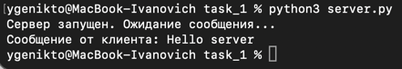
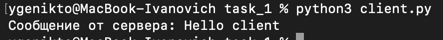
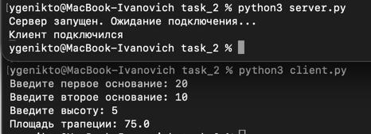
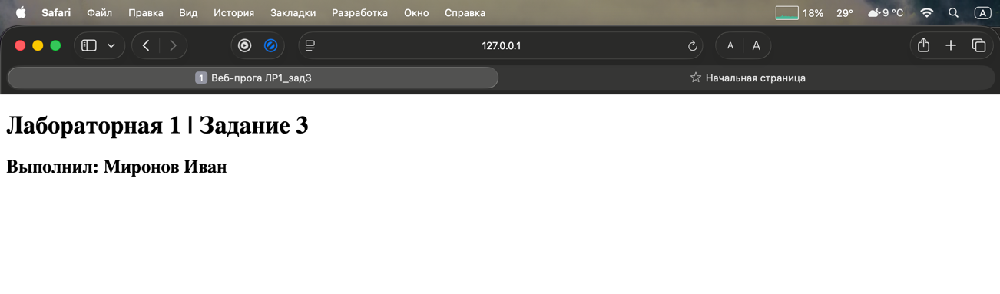
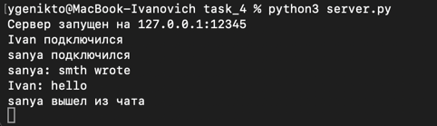
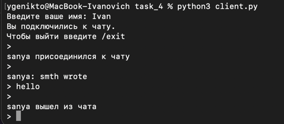
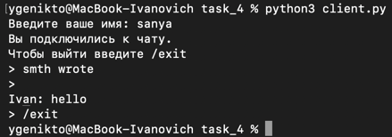
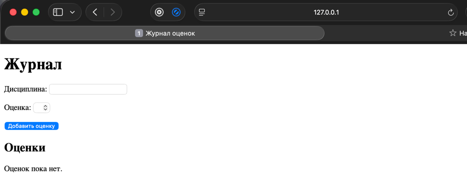
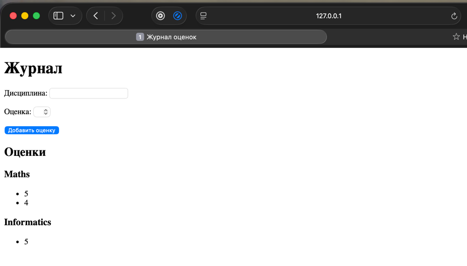

# Лабораторная работа №1

## Работа с сокетами

### Цель работы

Целью работы является изучение принципов взаимодействия клиента и сервера с использованием сокетов, а также получение практических навыков работы с протоколами UDP, TCP и HTTP.


## Задание 1. Обмен сообщениями по UDP

В первом задании реализован обмен сообщениями между клиентом и сервером по протоколу UDP, он не устанавливает постоянное соединение между клиентом и сервером. Для отправки сообщения используется метод `sendto()`, а для получения — `recvfrom()`.

??? info "Полный листинг server.py"

    ```python
    import socket

    server = socket.socket(socket.AF_INET, socket.SOCK_DGRAM)
    
    server.bind(("127.0.0.1", 12345))
    
    print("Сервер запущен. Ожидание сообщения...")
    
    data, address = server.recvfrom(1024)
    
    print("Сообщение от клиента:", data.decode("utf-8"))
    
    server.sendto("Hello client".encode("utf-8"), address)
    
    server.close()
    ```

??? info "Полный листинг client.py"
    ```python
    import socket
    
    client = socket.socket(socket.AF_INET, socket.SOCK_DGRAM)
    
    client.sendto("Hello server".encode("utf-8"), ("127.0.0.1", 12345))
    
    data, address = client.recvfrom(1024)
    
    print("Сообщение от сервера:", data.decode("utf-8"))
    
    client.close()
    ```


<strong>Результат работы</strong><br>

После запуска сервера и клиента клиент отправляет серверу сообщение `Hello, server`. Сервер получает сообщение и отправляет ответ `Hello, client`.




## Задание 2. Клиент-серверное приложение по TCP

Во втором задании реализовано TCP-соединение между клиентом и сервером. В журнале 19й номер, следовательно берем 3й вариант.

Клиент передаёт серверу значения, необходимые для вычисления площади трапеции. Сервер выполняет расчёт и возвращает результат клиенту.

Площадь трапеции вычисляется по формуле:

S = (a+b)*h)/2

где:

- `a` — первое основание;
- `b` — второе основание;
- `h` — высота.


??? info "Полный листинг server.py"
    ```python
    import socket
    
    server = socket.socket(socket.AF_INET, socket.SOCK_STREAM)
    server.bind(("127.0.0.1", 12345))
    server.listen(1)
    
    print("Сервер запущен. Ожидание подключения...")
    
    connection, address = server.accept()
    print("Клиент подключился")
    
    data = connection.recv(1024).decode("utf-8")
    
    a, b, h = map(float, data.split())
    
    area = (a + b) * h / 2
    
    connection.send(str(area).encode("utf-8"))
    
    connection.close()
    server.close()
    ```

??? info "Полный листинг client.py"
    ```python
    import socket
    
    client = socket.socket(socket.AF_INET, socket.SOCK_STREAM)
    
    client.connect(("127.0.0.1", 12345))
    
    a = float(input("Введите первое основание: "))
    b = float(input("Введите второе основание: "))
    h = float(input("Введите высоту: "))
    
    message = f"{a} {b} {h}"
    
    client.send(message.encode("utf-8"))
    
    data = client.recv(1024).decode("utf-8")
    
    print("Площадь трапеции:", data)
    
    client.close()
    ```
<strong>Результат работы</strong><br>



## Задание 3. Простой HTTP-сервер

В третьем задании простой HTTP-сервер с использованием TCP-сокета.

Сервер принимает HTTP-запрос от браузера, читает содержимое файла `index.html` и отправляет его клиенту в качестве HTTP-ответа.


??? info "Полный листинг server.py"
    ```python
    import socket
    
    server = socket.socket(socket.AF_INET, socket.SOCK_STREAM)
    server.bind(("127.0.0.1", 8080))
    server.listen(1)
    
    print(f"Сервер запущен: http://127.0.0.1:8080")
    
    while 1:
        connection, address = server.accept()
        print("Клиент подключился")
    
        with open("index.html", "r", encoding="utf-8") as file:
            html = file.read()
    
        response = (
            "HTTP/1.1 200 OK\r\n"
            "Content-Type: text/html; charset=utf-8\r\n"
            f"Content-Length: {len(html.encode('utf-8'))}\r\n"
            "\r\n"
            + html
        )
        connection.sendall(response.encode("utf-8"))
        connection.close()
    ```

Для отображения страницы я использовал отдельный файл `index.html`.
```html
<!DOCTYPE html>
<html lang="en">
<head>
    <meta charset="UTF-8">
    <title>Веб-прога ЛР1_задЗ</title>
</head>
<body>
    <h1>Лабораторная 1 | Задание 3</h1>
    <h2>Выполнил: Миронов Иван</h2>
</body>
</html>
```

<strong>Результат работы</strong><br>

После запуска сервера я открыл в браузере адрес, и отобразилась созданная HTML-страница.



## Задание 4. Многопользовательский TCP-чат

В четвёртом задании реализован многопользовательский чат.
Сервер принимает подключения нескольких клиентов. Для обработки каждого клиента создаётся отдельный поток с помощью `threading`.

Сообщения одного пользователя сервер пересылает остальным подключённым пользователям.

Для безопасной работы с общим словарём подключённых клиентов используется `threading.Lock`.


??? info "Полный листинг server.py"
    ```python
    import socket
    import threading
    
    HOST = "127.0.0.1"
    PORT = 12345
    
    clients = {}
    lock = threading.Lock()
    
    
    def broadcast(message, sender):
        with lock:
            for client in clients:
                if client != sender:
                    client.send(message.encode("utf-8"))
    
    
    def handle_client(client, address):
        try:
            name = client.recv(1024).decode("utf-8")
    
            with lock:
                clients[client] = name
    
            print(f"{name} подключился")
    
            broadcast(f"{name} присоединился к чату", client)
    
            while True:
                data = client.recv(1024)
    
                if not data:
                    break
    
                message = data.decode("utf-8")
    
                if message == "/exit":
                    break
    
                print(f"{name}: {message}")
    
                broadcast(f"{name}: {message}", client)
    
        finally:
            with lock:
                name = clients.pop(client, "Неизвестный пользователь")
    
            client.close()
    
            print(f"{name} вышел из чата")
            broadcast(f"{name} вышел из чата", client)
    
    
    def start_server():
        server = socket.socket(socket.AF_INET, socket.SOCK_STREAM)
        server.bind((HOST, PORT))
        server.listen()
    
        print(f"Сервер запущен на {HOST}:{PORT}")
    
        while True:
            client, address = server.accept()
    
            thread = threading.Thread(
                target = handle_client,
                args = (client, address)
            )
    
            thread.start()
    
    
    start_server()
    ```

??? info "Полный листинг client.py"
    ```python
    import socket
    import threading
    
    HOST = "127.0.0.1"
    PORT = 12345
    
    
    def receive_messages(client):
        while True:
            try:
                message = client.recv(1024).decode("utf-8")
    
                if not message:
                    break
    
                print("\n" + message)
                print("> ", end="", flush=True)
    
            except:
                break
    
    
    client = socket.socket(socket.AF_INET, socket.SOCK_STREAM)
    client.connect((HOST, PORT))
    
    name = input("Введите ваше имя: ")
    
    client.send(name.encode("utf-8"))
    
    thread = threading.Thread(
        target=receive_messages,
        args=(client,)
    )
    
    thread.daemon = True
    thread.start()
    
    print("Вы подключились к чату.")
    print("Чтобы выйти введите /exit")
    
    while True:
        message = input("> ")
    
        client.send(message.encode("utf-8"))
    
        if message == "/exit":
            break
    
    client.close()
    ```

<strong>Результат работы</strong><br>

Я запустил сервер и несколько экземпляров клиента. Пользователи подключились к одному чату и смогли обмениваться сообщениями.

Терминал сервера:<br>
<br>
Терминал первого клиента:<br>
<br>
Терминал второго клиента:<br>


## Задание 5. Простой веб-сервер с GET и POST

В пятом задании простой HTTP-сервер, который позволяет добавлять оценки по дисциплинам и просматривать журнал оценок.

Для добавления оценки используется HTTP-метод `POST`. Для получения страницы с журналом используется `GET`.

Данные хранятся в словаре, где ключом является название дисциплины, а значением — список оценок:

```
{
    "Математика": ["5", "4"],
    "Веб-программирование": ["5"]
}
```

??? info "Полный листинг server.py"
    ```python
    import socket
    from urllib.parse import parse_qs
    
    
    class MyHTTPServer:
        def __init__(self, host, port, name):
            self.host = host
            self.port = port
            self.name = name
            self.server = socket.socket(socket.AF_INET, socket.SOCK_STREAM)
            self.server.setsockopt(socket.SOL_SOCKET, socket.SO_REUSEADDR, 1)
    
            self.grades = {}
    
        def serve_forever(self):
            self.server.bind((self.host, self.port))
            self.server.listen()
    
            print(f"Сервер запущен: http://{self.host}:{self.port}")
    
            while True:
                client, address = self.server.accept()
                self.serve_client(client)
    
        def serve_client(self, client):
            request = self.parse_request(client)
    
            if request:
                self.handle_request(client, request)
    
            client.close()
    
        def parse_request(self, client):
            data = b""
    
            while b"\r\n\r\n" not in data:
                data += client.recv(4096)
    
            headers_data, body_data = data.split(b"\r\n\r\n", 1)
            lines = headers_data.decode("utf-8").split("\r\n")
    
            method, url, version = lines[0].split(" ")
    
            if "?" in url:
                path, query = url.split("?", 1)
                params = parse_qs(query)
            else:
                path = url
                params = {}
    
            headers = self.parse_headers(lines)
    
            length = int(headers.get("Content-Length", 0))
    
            while len(body_data) < length:
                body_data += client.recv(4096)
    
            body = body_data[:length].decode("utf-8")
    
            return {
                "method": method,
                "path": path,
                "params": params,
                "body": body
            }
    
        def parse_headers(self, lines):
            headers = {}
    
            for line in lines[1:]:
                if not line:
                    break
    
                name, value = line.split(":", 1)
                headers[name.strip()] = value.strip()
    
            return headers
    
        def handle_request(self, client, request):
            if request["method"] == "GET":
                self.send_page(client)
    
            elif request["method"] == "POST":
                data = parse_qs(request["body"])
    
                subject = data["subject"][0]
                grade = data["grade"][0]
    
                if subject not in self.grades:
                    self.grades[subject] = []
    
                self.grades[subject].append(grade)
    
                response = (
                    "HTTP/1.1 302 Found\r\n"
                    "Location: /\r\n"
                    "Connection: close\r\n"
                    "\r\n"
                )
    
                client.sendall(response.encode("utf-8"))
    
        def send_page(self, client):
            with open("index.html", "r", encoding="utf-8") as file:
                html = file.read()
    
            grades_html = ""
    
            for subject, grades in self.grades.items():
                grades_html += f"<h3>{subject}</h3><ul>"
    
                for grade in grades:
                    grades_html += f"<li>{grade}</li>"
    
                grades_html += "</ul>"
    
            if not grades_html:
                grades_html = "<p>Оценок пока нет.</p>"
    
            html = html.replace("{{GRADES}}", grades_html)
    
            response = (
                "HTTP/1.1 200 OK\r\n"
                "Content-Type: text/html; charset=utf-8\r\n"
                f"Content-Length: {len(html.encode('utf-8'))}\r\n"
                "Connection: close\r\n"
                "\r\n"
                + html
            )
    
            client.sendall(response.encode("utf-8"))
    
    
    if __name__ == "__main__":
        server = MyHTTPServer(
            "127.0.0.1",
            8080,
            "GradeServer"
        )
    
        try:
            server.serve_forever()
        except KeyboardInterrupt:
            pass
    ```

??? info "Полный листинг index.html"
    ```html
    <!DOCTYPE html>
    <html lang="ru">
    <head>
        <meta charset="UTF-8">
        <title>Журнал оценок</title>
    </head>
    <body>
        <h1>Журнал</h1>
    
        <form method="POST" action="/">
            <p>
                <label for="subject">Дисциплина:</label>
                <input type="text" id="subject" name="subject" required>
            </p>
    
            <p>
                <label for="grade">Оценка:</label>
                <input type="number" id="grade" name="grade" min="1" max="5" required>
            </p>
    
            <button type="submit">Добавить оценку</button>
        </form>
    
        <h2>Оценки</h2>
    
        {{GRADES}}
    </body>
    </html>
    ```
<strong>Результат работы</strong><br>

После запуска сервера я открыл страницу в браузере. Я ввёл название дисциплины и оценку, после чего оценка появилась в журнале.

Пустая страница:

Страница после добавления оценок:
